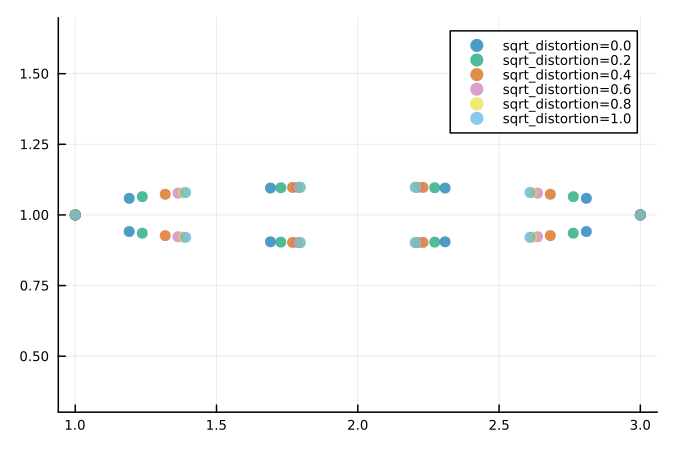

# Quick Start

The following plots require these lines to be run first:

```julia
using EllipseSampling, Plots; gr()
default(palette=:seaborn_colorblind6, msw=0, markeralpha=0.7, 
        aspect_ratio=:equal, label=nothing, dpi=150, size=(450,300))
Plots.scalefontsizes(0.75)
```

## Equally Spaced Points

To generate 9 equally spaced points on an ellipse, with x radius of 1.0 and y radius of 0.5, no rotation and a centre of ``x,y = [2,1]`` we use:

```julia
e=construct_ellipse(1.0, 0.5, 0.0, 2.0, 1.0)
points=generate_N_equally_spaced_points(9, e; start_point_shift=0.0) 
scatter(points[1,:], points[2,:])
```


Or alternatively:
```julia 
points=generate_N_equally_spaced_points(9, 1.0, 0.5, 0.0, 2.0, 1.0; start_point_shift=0.0) 
scatter(points[1,:], points[2,:])
```


### Rotated Ellipses

If instead our ellipse has an anticlockwise rotation of ``\frac{\pi}{3}`` radians or 60 degrees, we can modify that argument to [`construct_ellipse`](@ref).

```julia
e=construct_ellipse(1.0, 0.5, pi/3.0, 2.0, 1.0)
points=generate_N_equally_spaced_points(9, e; start_point_shift=0.0) 
scatter(points[1,:], points[2,:])
```


## Clustered Points

To more easily see the clustering effect we will increase the number of points generated and decrease the y radius. Note, the closer in magnitude the major and minor axis radii are, the weaker the clustering effect. 
To generate 30 clustered points on an ellipse, with x radius of 1.0 and y radius of 0.1, no rotation and a centre of ``x,y = [2,1]`` we use:

```julia
e=construct_ellipse(1.0, 0.1, 0.0, 2.0, 1.0)
points=generate_N_clustered_points(30, e; start_point_shift=0.0, sqrt_distortion=0.0) 
scatter(points[1,:], points[2,:])
```


The clustering effect becomes weaker when we increase the parameter `sqrt_distortion` towards 1.0:

```julia
plot()
e=construct_ellipse(1.0, 0.1, 0.0, 2.0, 1.0)
for sqrt_distortion in 0.0:0.2:1.0
    points=generate_N_clustered_points(10, e; start_point_shift=0.0, sqrt_distortion=sqrt_distortion) 
    scatter!(points[1,:], points[2,:], label=string("sqrt_distortion=",sqrt_distortion))
end
```



The clustering effect is completely gone if our ellipse is a circle:

```julia
plot(palette=:Paired_6)
e=construct_ellipse(1.0, 1.0, 0.0, 2.0, 1.0)
for sqrt_distortion in 0.0:0.5:1.0
    points=generate_N_clustered_points(10, e; start_point_shift=0.0, sqrt_distortion=sqrt_distortion) 
    scatter!(p, points[1,:], points[2,:], label=string("sqrt_distortion=",sqrt_distortion),
            markersize=7-sqrt_distortion*4, markeralpha=0.6)
end
```


## Custom Sampling Method

If we want to use a custom sampling method that is different to the equal spacing and clustered methods then we can use [`generate_perimeter_point`](@ref) coupled with any arbitrary distribution defined on \[0,1\]. For example, if we want to take 100 uniform random samples (uniform with respect to arc length) of our ellipse perimeter we would use:

```julia
e=construct_ellipse(1.0, 0.5, 0.0, 2.0, 1.0)
N = 100
samples = rand(N)

# wrap e in Ref so that the function correctly broadcasts across samples
points = generate_perimeter_point.(samples, Ref(e)) 
points = reduce(hcat, points)

scatter(points[1,:], points[2,:])
```

